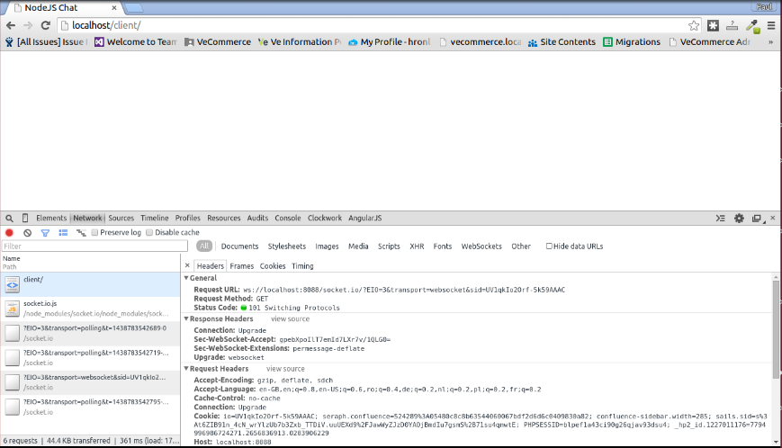

# Simple chat using ExpressJS, and Socket.IO transcript

## Pre-requisites
Prior developing the chat, we need to have installed [Node JS](https://github.com/joyent/node/wiki/Installing-Node.js-via-package-manager), [npm](https://github.com/npm/npm#super-easy-install), and [bower](https://www.npmjs.com/package/bower#install).
This demo also presumes you have access to your http://localhost environment.

## Used packages
<ul>
    <li>
        Bower packages:
        <ul>
            <li>jQuery - to ease up DOM manipulation</li>
        </ul>
    </li>
    <li>
        npm packages:
        <ul>
            <li>ExpressJS - for easier integration with Socket.IO</li>
            <li>Socket.IO - for client-server data transport</li>
            <li>MomentJS - for easier date manipulation</li>
        </ul>
    </li>
</ul>

## Step 1. Defining the directory structure.

Firstly, let's create bower.json, and package.json files, where we can store the client/server-side packages.

    bower init
    npm init

_Feel free to hit enter to all the required prompts._

As we need jQuery for client-side, and ExpressJS, SocketIO, and MomentJS for server-side, let's all them to the project.

    bower install jquery --save
    npm install express socket.io moment --save

_This will install the proper packages in `bower_components/`, and `node_modules/` directories, update `bower.json`,
and `package.json` with the latest mentioned package versions._

Now, we can create two directories that would suite server, and client needs.

    mkdir server client

Finally, we can create the next files:

    touch server/server.js  # the node server-side server,
    touch client/index.html # the homepage to be viewed on the browser,
    touch client/script.js  # miscellaneous UX enhancements,
    touch client/style.css  # minimal page styling.

## Step 2. Writing our node server, powered by ExpressJS framework.

First, we open our `server/server.js` file and input the following:

    // Load ExpressJS, HTTP, SocketIO, and MomentJS libraries.
    var app = require('express')(),
        http = require('http').Server(app),
        io = require('socket.io')(http);
    
    // Define the port on which the server will be launched.
    var port = 3000;
    
    // Handle the client connecting to the socket.
    io.on('connection', function(socket) {
        console.log('A client has connected.');

        // Handle client disconnection.
        socket.on('disconnect', function() {
            console.log('The client has disconnected.');
        });
    });
    
    // Start the HTTP server.
    http.listen(port, function() {
        console.log('Listening on *:' + port);
    });

Then, you can launch the server with `node server/server.js`. It will prompt you `Listening on *:3000`. On a separate
terminal, we can test that socket.io handshake works.
Simply run `curl http://localhost:3000/socket.io/?transport=polling`, amd we will receive a json response like as
follows:

    {
        "sid": "6tdRcYuk1CDf3u5rAAAG",
        "upgrades": ["websocket"],
        "pingInterval": 25000,
        "pingTimeout": 60000
    }

## Step 3. Creating the client-side.

Now that we have the server-side prepared, let's insert the following code snippet into client/index.html

    <!DOCTYPE html>
    <html lang="en">
    <head>
        <title>NodeJS Chat</title>
    </head>
    <body>
    
    
    </body>
    </html>

Then, you can open your preferred browser and access the page online at `http://localhost/client/index.html`.

If you enable your Inspector, you will recognise a request to http://localhost:3000/socket.io with some parameters,
responding with _101 Switching protocols_. This is a result of `var socket = io('http://localhost:3000');`.

If you are to switch back to the terminal that launched the node server, you'll see that _A client has connected_.
You can also open the same URL from a different browser/ same browser tab, and you'll reckon that a you're receive a new
client connection on your node server.

You can also close the tab, and a result, SocketIO catches that, so it will call socket.on('disconnect') callback.
Therefore, you will see on your node server _The client has disconnected_.

## Step 4. Broadcasting messages cross server-client platforms.

Now, try our first broadcast from client to server, and back. In `client/index.html`, let's add the following:

    socket.emit('toServer', 'hello from client');
    socket.on('fromServer', function(data) {
        console.log('server said', data);
    });

so, our file would look like:

    <!DOCTYPE html>
    <html lang="en">
    <head>
        <title>NodeJS Chat</title>
    </head>
    <body>
    
    
    </body>
    </html>

On our `server/server.js`, let's add:

    socket.on('toServer', function(data) {
        console.log('client said', data);
    });
    
    socket.emit('fromServer', 'hello from server');

so, our file would look like:

    // Load ExpressJS, HTTP, SocketIO, and MomentJS libraries.
    var app = require('express')(),
        http = require('http').Server(app),
        io = require('socket.io')(http);
        
    // Define the port on which the server will be launched.
    var port = 3000;
    
    // Handle the client connecting to the socket.
    io.on('connection', function(socket) {
        console.log('A client has connected.');
        
        // Handle client disconnection.
        socket.on('disconnect', function() {
            console.log('The client has disconnected.');
        });
        
        socket.on('toServer', function(data) {
            console.log('client said', data);
        });
        
        socket.emit('fromServer', 'hello from server');
    });
    
    // Start the HTTP server.
    http.listen(port, function() {
        console.log('Listening on *:' + port);
    });

If we restart the node server (Ctrl+C, and run again `node server/server.js`), and then we launch
http://localhost/client/index.html, we will see the following:

On the node terminal:

    Listening on *:8088
    A client has connected.
    client said hello from client

On our browser console:

    server said hello from server

Now, this happens with no XHR cost, the data transport is carried through the Pending handshake request.

## Step 5. Start implementing the client-side chat.

As we learnt that we are able to establish 100% interactive communication between server to client-side, we will move
forward preparing the client-side.

First, let's add some styling in `client/style.css`:

    * { margin: 0; padding: 0; box-sizing: border-box; }
    body { font: 13px Helvetica, Arial; }
    form { background: #000; padding: 3px; position: fixed; bottom: 0; width: 100%; }
    form input { border: 0; padding: 10px; width: 100%; margin-right: .5%; }
    form button { width: 9%; background: #B2D234; border: none; padding: 10px; }
    .messages { list-style-type: none; margin: 0; padding-bottom: 50px; max-height: 600px; overflow-y: auto; }
    .messages li { padding: 5px 10px; }
    .messages li:nth-child(odd) { background: #eee; }

Second, let's enhance the UX by ensuring the last chat messages are always scrolled, focus on the input field, etc.
We insert the following on `client/script.js`:

    // Scrolls the messages chat box to its bottom, enhancing UX.
    var scrollBottom = function() {
        $('.messages').scrollTop($('.messages')[0].scrollHeight);
    };
    
    // Dynamically resize the messages chat box by the page size, with a 50px offset.
    var resizeMessages = function() {
        $('.messages').css('max-height', ($(window).height() - 50) + 'px');
    };
    
    // Resize, and scrolls bottom the chat messages.
    var fitMessages = function() {
        resizeMessages();
        scrollBottom();
        $('input').focus();
    };
    
    // Warming up the chat, fitting the messages, and focusing on the input message.
    fitMessages();
    
    // Handling particular events such as receiving a new message, and resizing window.
    $('.messages').bind('DOMNodeInserted DOMNodeRemoved', fitMessages);
    $(window).on('resize', fitMessages);
    
Finally, we tight things on our `client/index.html` file:

    <!DOCTYPE html>
    <html lang="en">
    <head>
        <meta charset="UTF-8" />
        <meta name="viewport" content="width=device-width, initial-scale=1" />
        <title>NodeJS Chat</title>
        <link href="style.css" rel="stylesheet" />
    </head>
    <body>
    
    <!-- Chat messages goes here. -->
    <ul class="messages"></ul>
    <!-- Your new message goes here. -->
    <form>
        <input placeholder="Your text here..." autocomplete="off" type="text" />
    </form>
    
    
    
    
    
    </body>
    </html>

## Step 6. Preparing the node server for the chat features.

The only thing left is to ensure the node server interacts with client environment receiving and sending the
chat messages properly. To do that, let's adjust the `server/server.js` file as follows:

    // Load ExpressJS, HTTP, SocketIO, and MomentJS libraries.
    var app = require('express')(),
        http = require('http').Server(app),
        io = require('socket.io')(http),
        moment = require('moment');
    
    // Declare messages collection, and launch port.
    var messages = [],
        port = 3000,
        dateFormat = 'hh:mm';
    
    // Handle the client connecting to the socket.
    io.on('connection', function(socket) {
    
        var
        // Provide a name to the newly connected client, based on the socket connection id.
            client = 'G_' + socket.conn.id.substring(0, 4),
        // Set the current date, user-friendly formatted.
            date = moment().format(dateFormat),
        // New connection message to be broadcasted to clients.
            messageData = {
                client: client,
                date: date,
                message: 'Hey there, I just joined the chat!'
            };
    
        console.log(client + ' connected.');
    
        messages.push(messageData);
    
        // Broadcast the current messages to the newly connected client.
        socket.emit('currentMessages', messages);
        // Broadcast to all client listeners (except the newly connected client) about the new joined client.
        socket.broadcast.emit('newMessage', messageData);
    
        // Receive new messages from client.
        socket.on('newMessage', function(message) {
    
            console.log(client + ' said ', message);
    
            var date = moment().format(dateFormat),
                messageData = {
                    client: client,
                    date: date,
                    message: message
                };
    
            messages.push(messageData);
            // Announce the new message to all participants (including the current client).
            io.sockets.emit('newMessage', messageData);
    
        });
    
        // Handle a disconnected client.
        socket.on('disconnect', function() {
    
            var date = moment().format(dateFormat);
            var messageData = {
                client: client,
                date: date,
                message: 'Bye-bye!'
            };
    
            messages.push(messageData);
            io.sockets.emit('newMessage', messageData);
    
            console.log(client + ' disconnected.');
    
        });
    
    });
    
    // Start the HTTP server.
    http.listen(port, function() {
        console.log('Listening on *:' + port);
    });

After that, we can restart our changed node server (Ctrl+C, `node server/server.js`), and refresh
our `http://localhost/client/index.html` page.

As you chat, you'll notice that no additional AJAX/ HTTP requests are performed.

Everything happens within the frames of the Pending Handshake request.

For a live demo, you can access [http://nodejs-demo.veinteractive.net/client/index.html](http://nodejs-demo.veinteractive.net/client/index.html).

# Thank you!